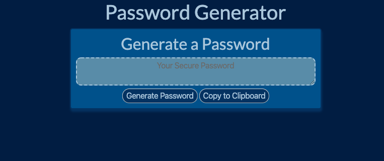

# Password_Generator
This is the third assignment for the UW Coding Bootcamp Winter 2019. The uploaded site is a page that quickly generates a password with a length between 8 and 128 that conforms to the user's preferences. 

## Getting Started
Download the repository and begin by opening the index.html file. To generate a password, press the "Generate Password" button. Following that will be four prompts asking the user if they would like special characters, numbers, lower case characters, or upper case characters to be included in the password. Following the 4th prompt, the user will be prompted for the last time for the length of the password. After the password has been generated, the password can be copied to the clipboard for ease of use.

## Link
https://joshlo1995.github.io/3.Password_Generator/

## Screenshot

## Authors
- Joshua Lo

## Acknowledgements
- My dogs, Taco and Nando
- John Cena
